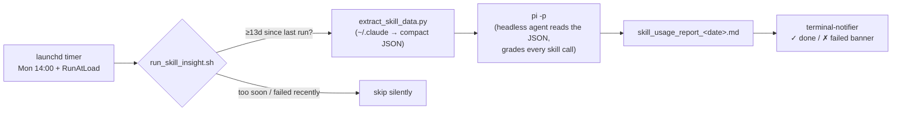

# pi-skill-insight

> **What if a headless AI agent reviewed how *you* work — every two weeks, on a cron, while you sleep?**
>
> A real-world **case study of using `pi -p` (a headless agent CLI) as a scheduled automation engine.**
> The worked example: a biweekly job that grades your own Claude Code **skill usage** and tells you
> which skills help, which misfire, and exactly how to fix them.
>
> 一个**「把 `pi -p` 当定时自动化引擎」的真实案例研究**。范例任务：每两周自动复盘你自己的
> Claude Code **skill 使用情况**——哪些在帮忙、哪些在帮倒忙、该怎么改。

`macOS` · `launchd` · `zsh + python3` · powered by the [`pi`](https://github.com/) agent in headless `-p` mode

[English](#english) · [中文](#中文) · [📄 Sample report](examples/sample_report.md)

---

## English

### The idea in one picture



The interesting part isn't the report — it's that **a one-shot AI agent (`pi -p`) is wired up as
a self-healing cron job**. That harness is reusable for *any* "let an agent do X on a schedule"
task. This repo is the smallest complete example of it.

### The case study

**Problem.** You accumulate dozens of custom skills / slash-commands for your AI coding agent,
but you never actually know which ones *work*. Good ones save you keystrokes; bad ones quietly
make you babysit and correct the agent. You have no feedback loop.

**The insight.** The signal is already in your transcripts: **when a skill underperforms, you send
several correction/guidance messages right after invoking it.** Each "post-invocation manual
correction" is ground-truth evidence the skill fell short. Treat every real skill call as a test
case, and your own follow-up messages as the grader.

**The engine.** Rather than build an analysis pipeline by hand, hand the evidence to an agent:
`pi -p "<a long, structured grading prompt>"`. Headless `-p` mode runs the agent non-interactively,
to completion, and exits — exactly what a cron job needs. The agent does the reading, grading,
clustering, baseline comparison, and writes a Markdown report.

**The harness.** Wrapping a `-p` agent call in a robust scheduled task is where the real
engineering is. `run_skill_insight.sh` adds, around the single `pi -p` line:

- **Biweekly gate** — a last-success marker keeps the effective cadence at ≥13 days, regardless of how often the timer fires.
- **Self-heal** — `launchd` fires Monday 14:00 *and* `RunAtLoad`; a Monday missed while the Mac was off is caught up on the next boot.
- **Honest data window** — analyzes the *actual* gap since the last run (clamped 14–28d), so catch-up runs neither skip nor double-count.
- **Failure backoff** — after a failure, hold off retrying/re-notifying for 12h.
- **Single-instance lock** — stale lock >6h is stolen.
- **Notify only on outcomes** — a desktop banner on report-done ✓ / failed ✗; skips stay silent.

**The result.** Every two weeks, a banner; a report like [`examples/sample_report.md`](examples/sample_report.md)
with a scorecard, per-skill intervention analysis, your own quoted words as evidence, copy-paste
`SKILL.md` rewrites, and a follow-up on whether last cycle's fixes actually moved the numbers.

```
┌─────────────────────────────────────────────┐
│  ● Skill Insight 定时任务                     │
│  运行完成 ✓ 报告已生成（距上次 14 天）         │
│  skill_usage_report_2026-05-26.md            │
└─────────────────────────────────────────────┘
```

### Reuse the pattern — `pi -p` as a cron job

The whole point of a case study is that you can lift the pattern. To build your *own* scheduled
agent task, keep the harness in `run_skill_insight.sh` and swap two things:

1. **The prompt** — replace the `PROMPT=$(cat <<EOF … EOF)` block with your task.
2. **The pre-extraction** (optional) — `extract_skill_data.py` exists only to compress GBs of
   logs into one compact JSON so the agent reads cheaply. Drop it if your task doesn't need it.

Everything else — gate, self-heal, window, lock, backoff, notify — is task-agnostic boilerplate
you get for free. The same shape works for "summarize my week", "triage new issues nightly",
"diff the docs against the code every Friday", etc.

> Using a different headless agent (e.g. `claude -p`, `codex -p`)? Swap the one `pi -p` line —
> the harness doesn't care which agent it drives.

### Requirements

- **[`pi`](https://github.com/)** — the agent CLI that performs the analysis (headless `-p` mode). The script extends `PATH` with `$HOME/.local/bin` and `/opt/homebrew/bin` to find it.
- **`terminal-notifier`** — desktop banners: `brew install terminal-notifier` (first run may need approval in *System Settings → Notifications*).
- **`python3`** — runs the pre-extractor.
- Reads `~/.claude/projects/**/*.jsonl`, `~/.claude/history.jsonl`, `~/.claude/skills`, `~/.claude/plugins`.

### Install

```sh
git clone https://github.com/<you>/pi-skill-insight && cd pi-skill-insight

# 1. point the launchd template at your real path (two placeholders), then:
cp com.henry.skill-insight.plist ~/Library/LaunchAgents/
#    edit the two /ABSOLUTE/PATH/TO/pi-skill-insight paths inside it first
launchctl load ~/Library/LaunchAgents/com.henry.skill-insight.plist
```

The script self-locates (`BASE_DIR`), so the repo can live anywhere. Uninstall:
`launchctl unload ~/Library/LaunchAgents/com.henry.skill-insight.plist`.

### Run once now

```sh
./run_skill_insight.sh --force   # bypass the biweekly gate; does not shift the schedule
```

### Output & privacy

Everything lands in `skill-log/` — logs, reports, the extraction cache, and state markers.
**`skill-log/` is gitignored**: it derives from your private `~/.claude` transcripts and never
leaves your machine. The only sample in this repo is the **synthetic** one under `examples/`.

### Troubleshooting

- Logs: `tail -f skill-log/skill_insight.log`
- Job status: `launchctl list com.henry.skill-insight` (`LastExitStatus = 0` is healthy)
- No notification: ensure `terminal-notifier` is installed and allowed in *System Settings → Notifications*.

### Layout

| File | Purpose |
|---|---|
| `run_skill_insight.sh` | The harness: gate, window, lock, backoff, notify — wraps one `pi -p` call |
| `extract_skill_data.py` | Pre-extracts `~/.claude` skill calls into one compact JSON for the agent |
| `com.henry.skill-insight.plist` | launchd job template (edit the two paths before installing) |
| `examples/sample_report.md` | Synthetic illustrative output |
| `skill-log/` | Real output + state (gitignored, local only) |

MIT licensed — see [LICENSE](LICENSE).

---

## 中文

### 一图看懂

见上方架构图：`launchd` 定时器（周一 14:00 + 开机）→ `run_skill_insight.sh`（双周门槛）→
`extract_skill_data.py`（把 `~/.claude` 压成紧凑 JSON）→ **`pi -p`（headless agent 读 JSON、给每次
skill 调用打分）**→ 生成报告 → `terminal-notifier` 弹横幅。

真正有意思的不是报告本身，而是**把一次性的 AI agent（`pi -p`）接成了一个会自愈的 cron 任务**。
这套外壳对「让 agent 定时做某事」是通用的，本仓是它最小的完整范例。

### 案例研究

**问题。** 你给 AI 编码 agent 攒了几十个自定义 skill / 命令，却从不知道哪些真有用。好的省事，
差的让你不停盯着纠正。你没有反馈闭环。

**洞察。** 信号其实就在对话记录里：**某个 skill 效果不好时，你会在调用之后连发几条纠正/指引消息。**
每条「调用后的人工纠正」都是 skill 没写到位的铁证。把每次真实调用当测试用例，把你的后续消息当评分员。

**引擎。** 与其手写分析流水线，不如把证据交给 agent：`pi -p "<一段结构化的评分长提示>"`。headless
`-p` 模式让 agent 非交互地一次跑完并退出——正是 cron 需要的。读取、打分、聚类、基线对比、写报告，
全由 agent 完成。

**外壳。** 把一次 `-p` 调用包成健壮的定时任务，才是工程所在。`run_skill_insight.sh` 在那一行 `pi -p`
外面加了：

- **双周门槛** —— last-success 标记把有效节奏锁在 ≥13 天，无论定时器触发多频繁。
- **自愈** —— `launchd` 周一 14:00 触发，外加 `RunAtLoad`；关机错过的周一会在下次开机补跑。
- **诚实的数据窗口** —— 分析距上次的真实天数（夹 14–28 天），补跑也不漏不重。
- **失败退避** —— 失败后 12 小时内不重试、不重复弹通知。
- **单实例锁** —— 超 6 小时的陈旧锁会被抢占。
- **只在结果时通知** —— 出报告 ✓ / 失败 ✗ 才弹横幅，跳过静默。

**产出。** 每两周一条横幅；一份像 [`examples/sample_report.md`](examples/sample_report.md) 的报告：
记分卡、逐 skill 干预分析、你的原话证据、可直接粘贴的 `SKILL.md` 改写、以及上期建议是否真的把数字
改善了的追踪。

### 复用这套模式 —— 把 `pi -p` 当 cron 任务

案例研究的意义在于能照搬。要做你自己的定时 agent 任务，保留 `run_skill_insight.sh` 的外壳，只换两处：

1. **提示词** —— 把 `PROMPT=$(cat <<EOF … EOF)` 那段换成你的任务。
2. **预提取（可选）** —— `extract_skill_data.py` 只是为了把 GB 级日志压成一份紧凑 JSON 让 agent 便宜地读。任务不需要就删掉。

其余——门槛、自愈、窗口、锁、退避、通知——都是与任务无关的白送样板。同样的形状适用于「总结我这周」「每晚
三分类新 issue」「每周五把文档和代码对一遍」等等。

> 用别的 headless agent（`claude -p`、`codex -p`…）？换掉那一行 `pi -p` 即可，外壳不在乎驱动的是谁。

### 依赖 / 安装 / 运行

- **`pi`**（headless `-p`）、**`terminal-notifier`**（`brew install terminal-notifier`）、**`python3`**；读取 `~/.claude` 下的记录。
- 安装：把 `com.henry.skill-insight.plist` 里两处 `/ABSOLUTE/PATH/TO/...` 占位符改成实际路径 → 复制到 `~/Library/LaunchAgents/` → `launchctl load`。脚本自定位，仓库可放任意位置。
- 立刻跑一次：`./run_skill_insight.sh --force`（绕过门槛、不影响节奏）。

### 输出与隐私

产物都在 `skill-log/`，**已被 gitignore**：源自你私人的 `~/.claude` 记录，绝不离开本机。仓里唯一的样例是
`examples/` 下那份**合成**报告。

MIT 许可 —— 见 [LICENSE](LICENSE)。
