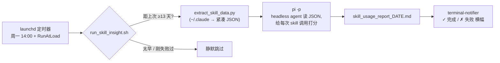

# pi-skill-insight

[English](README.md) · **中文**

> **如果有个 headless AI agent，每两周趁你睡觉时、在 cron 上复盘一遍你自己是怎么工作的，会怎样？**

一个**「把 `pi -p`（headless agent CLI）当定时自动化引擎」的真实案例研究**。范例任务：每两周自动
复盘你自己的 Claude Code **skill 使用情况**——哪些在帮忙、哪些在帮倒忙、该怎么改。

*macOS · launchd · zsh + python3 · 由 [`pi`](https://github.com/) agent 的 headless `-p` 模式驱动*

📄 看一份[示例报告](examples/sample_report.md)。

## 一图看懂



真正有意思的不是报告本身，而是**把一次性的 AI agent（`pi -p`）接成了一个会自愈的 cron 任务**。
这套外壳对「让 agent 定时做某事」是通用的，本仓是它最小的完整范例。

## 案例研究

**问题。** 你给 AI 编码 agent 攒了几十个自定义 skill / 命令，却从不知道哪些真有用。好的省事，
差的让你不停盯着纠正。你没有反馈闭环。

**洞察。** 信号其实就在对话记录里：**某个 skill 效果不好时，你会在调用之后连发几条纠正/指引消息。**
每条「调用后的人工纠正」都是 skill 没写到位的铁证。把每次真实调用当测试用例，把你的后续消息当评分员。

**引擎。** 与其手写分析流水线，不如把证据交给 agent：`pi -p "<一段结构化的评分长提示>"`。headless
`-p` 模式让 agent 非交互地一次跑完并退出——正是 cron 需要的。读取、打分、聚类、基线对比、写报告，
全由 agent 完成。

**外壳。** 把一次 `-p` 调用包成健壮的定时任务，才是工程所在。`run_skill_insight.sh` 在那一行 `pi -p`
外面加了：

- **双周门槛** —— last-success 标记把有效节奏锁在 ≥13 天，无论定时器触发多频繁。
- **自愈** —— `launchd` 周一 14:00 触发，外加 `RunAtLoad`；关机错过的周一会在下次开机补跑。
- **诚实的数据窗口** —— 分析距上次的真实天数（夹 14–28 天），补跑也不漏不重。
- **失败退避** —— 失败后 12 小时内不重试、不重复弹通知。
- **单实例锁** —— 超 6 小时的陈旧锁会被抢占。
- **只在结果时通知** —— 出报告 ✓ / 失败 ✗ 才弹横幅，跳过静默。

**产出。** 每两周一条横幅；一份像 [`examples/sample_report.md`](examples/sample_report.md) 的报告：
记分卡、逐 skill 干预分析、你的原话证据、可直接粘贴的 `SKILL.md` 改写、以及上期建议是否真的把数字
改善了的追踪。

```
┌─────────────────────────────────────────────┐
│  ● Skill Insight                              │
│  完成 ✓ — 报告已生成（距上次 14 天）           │
│  skill_usage_report_2026-05-26.md             │
└─────────────────────────────────────────────┘
```

## 复用这套模式：把 `pi -p` 当 cron 任务

案例研究的意义在于能照搬。要做你自己的定时 agent 任务，保留 `run_skill_insight.sh` 的外壳，只换两处：

1. **提示词** —— 把 `PROMPT=$(cat <<EOF … EOF)` 那段换成你的任务。
2. **预提取（可选）** —— `extract_skill_data.py` 只是为了把 GB 级日志压成一份紧凑 JSON 让 agent 便宜地读。任务不需要就删掉。

其余——门槛、自愈、窗口、锁、退避、通知——都是与任务无关的白送样板。同样的形状适用于「总结我这周」
「每晚三分类新 issue」「每周五把文档和代码对一遍」等等。

> 用别的 headless agent（`claude -p`、`codex -p`…）？换掉那一行 `pi -p` 即可，外壳不在乎驱动的是谁。

## 依赖

- **[`pi`](https://github.com/)** —— 负责跑分析的 agent CLI（headless `-p`）。脚本会把 `PATH` 扩到 `$HOME/.local/bin` 和 `/opt/homebrew/bin` 来找它。
- **`terminal-notifier`** —— 桌面横幅：`brew install terminal-notifier`（首次可能需在「系统设置 → 通知」允许）。
- **`python3`** —— 跑预提取脚本。
- 读取 `~/.claude/projects/**/*.jsonl`、`~/.claude/history.jsonl`、`~/.claude/skills`、`~/.claude/plugins`。

## 安装

```sh
git clone https://github.com/henrywen98/pi-skill-insight
cd pi-skill-insight
```

1. 打开 `com.henry.skill-insight.plist`，把里面两处 `/ABSOLUTE/PATH/TO/pi-skill-insight` 占位符
   换成本文件夹的真实绝对路径（脚本路径 + 日志路径）。
2. 安装并启动 launchd 任务：

```sh
cp com.henry.skill-insight.plist ~/Library/LaunchAgents/
launchctl load ~/Library/LaunchAgents/com.henry.skill-insight.plist
```

脚本自定位（`BASE_DIR`），仓库可放任意位置。卸载：
`launchctl unload ~/Library/LaunchAgents/com.henry.skill-insight.plist`。

## 立刻跑一次

```sh
./run_skill_insight.sh --force   # 绕过双周门槛立刻出报告；不影响定时节奏
```

## 输出与隐私

所有产物都在 `skill-log/`——日志、报告、提取 cache、状态标记。**`skill-log/` 已被 gitignore**：
它源自你私人的 `~/.claude` 对话记录，绝不离开本机。仓里唯一的样例是 `examples/` 下那份**合成**报告。

## 排错

- 看日志：`tail -f skill-log/skill_insight.log`
- 任务状态：`launchctl list com.henry.skill-insight`（`LastExitStatus = 0` 为正常）
- 没收到通知：确认 `terminal-notifier` 已装，且「系统设置 → 通知」里允许其横幅。

## 目录

| 文件 | 作用 |
| --- | --- |
| `run_skill_insight.sh` | 主外壳：门槛、窗口、锁、退避、通知——包住一次 `pi -p` 调用 |
| `extract_skill_data.py` | 预提取 `~/.claude` skill 调用，压成一份紧凑 JSON 供 agent 读 |
| `com.henry.skill-insight.plist` | launchd 任务模板（安装前改两处路径） |
| `examples/sample_report.md` | 合成示例产出 |
| `skill-log/` | 真实输出与状态（gitignore，仅本地） |

## 许可证

[MIT](LICENSE)
